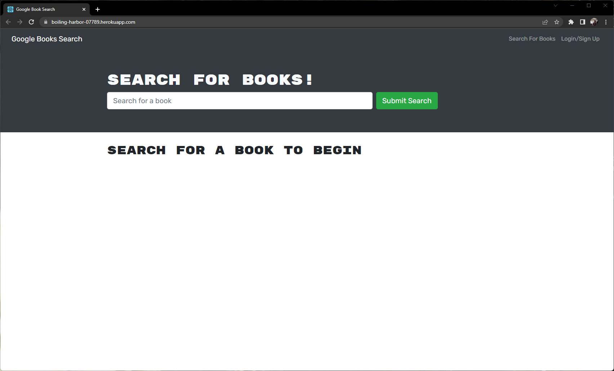
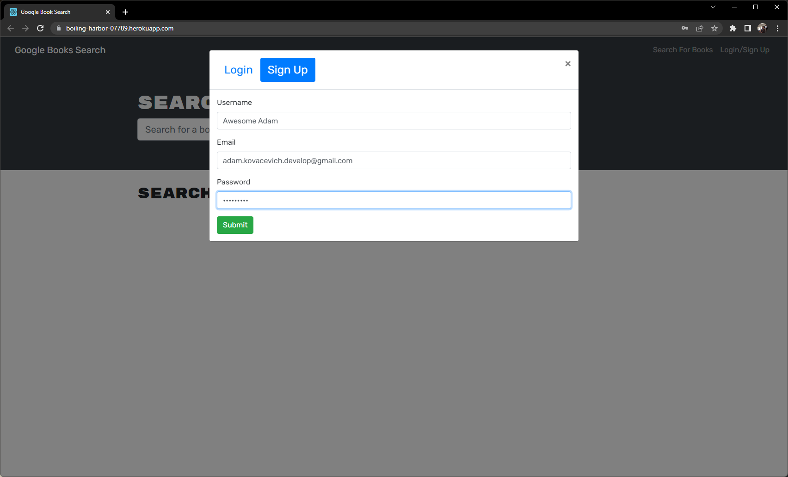

# Book-Searching-Engine

  ## Table of Contents  
  1.[Description](#Description)  
  2.[Installation](#Installation)  
  3.[Usage](#Usage)  
  4.[Credits](#Credits)  
  5.[License](#License)  
  6.[Badges](#Badges)  
  7.[Contribute](#Contribute)  
  8.[Tests](#Tests)  

  ## Description  
  This is a MERN stack application using the Google Books API Search Engine. Built and tested using GraphQL API and an Apollo Server. The application is built using React, MongoDB, Node.js and Express.js. 
  ## License  
    
 
  [Link to License](./LICENSE.md)
 
  ## Deployed Application     
   
  [Click here to view the deployed application](https://boiling-harbor-07789.herokuapp.com/)  
  

  ## Github Repo  
  [Click Here to view the Github Repository](https://github.com/Kovaceva11/Book-Searching-Engine)  
  ## Installation  
  Clone the repo. Then run the following commands in the root directory. 
  ```
  npm install
  ```

  ```
  npm run develop
  ```

>Note: If you are installing locally and run into an error that says the Babel-Jest is deprecated. Please create a .env file in the Client Folder. Then add the following code to it. `SKIP_PREFLIGHT_CHECK=true`


  ## Usage  
  Start Searching by entering your favorite book or author into the search field. 
  

  Login/Sign Up using the credentials of your choice. 
  

  Save Books by clicking the "Save This Book!" Button at the bottom of the book description. 
  

  Remove Books from your profile by selecting the "Delete This Book!" button. 
  
  ## Credits  
  MDN, Stackoverflow, npmjs, React, MongoDb, Apollo GraphQL 
   ## Badges  
    
     

  